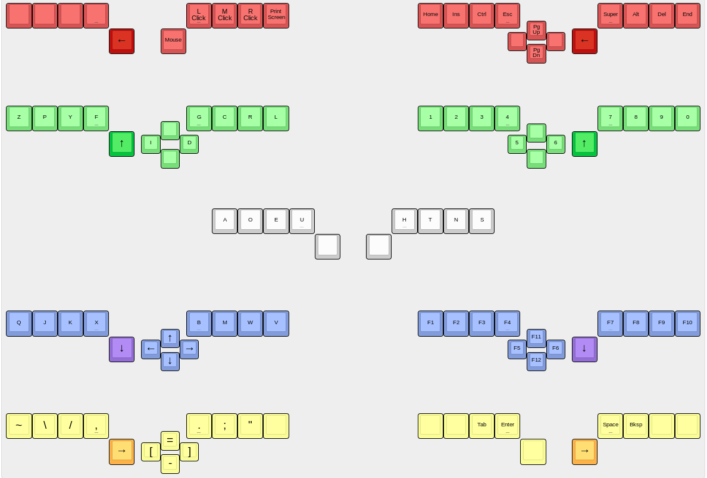

# Ochito
An ergonomic, split, wireless keyboard featuring 8 keys and 2 dpads. "Ochito" comes from the small form factor of only 8 keys. The diminutive in spanish is used by adding '-ito' to the end of a word, in this case "ocho" or eight.

## Physical Layout
The render below demonstrates what the right hand side of the keyboard will look like. With a single row of keys seen in brown, finger extension as well as lateral movement is kept to a minimum. In theory this would reduce strain as well as the risk of RSI. The flat cylinder seen in blue is a 5 directional pad allowing for key combinations or "chording" to type all keys on a normal keyboard.

## Keymap
Below is an initial keymap for the Type 82. Multiple colors can be seen demonstrating different "layers". Using [QMK](https://qmk.fm/) keyboard firmware, all standard keys can be typed by utilizing QMK's "layer" feature. On a normal keyboard, one can think of pressing the Shift key as a layer change. Normally there is not a single key that one can press to type a capital `A`; instead, one must first hold the Shift key to access the capital letter "layer" and then press the `a` key to type a capital `A`. 

The Type 82 uses the concept of layers to an extreme. Each color represents two layers accessible by moving the directional pad in one of the cardinal directions. For example, the red layer on the left half of the image below is accessed by first holding the dpad on the left half of the keyboard in the left direction. As can be seen, while holding the dpad to the left, this makes the keys under the right fingers act as left click, middle click, right click, and printscreen. Further, the right hand dpad will move the mouse cursor in the direction it is pressed. To reach the red layer on the right half of the image, the right hand dpad must be held in the left direction and combined with another key. In this manner all standard keys can be typed as seen in the example keymap.

While the letter layout might seem random at first, it's in fact a modification of the [dvorak](https://en.wikipedia.org/wiki/Dvorak_keyboard_layout) keyboard layout. While the QWERTY keyboard layout is standard, it is only so due to tradition. Popularized by typewriters as a way to minimize jamming of the arms which would imprint letters on paper, QWERTY has remained the default far past the standardization of digital input. The dvorak layout, while failing to replace QWERTY, offers a more comfortable typing experience while placing more frequently used keys on the home row as well as promoting a flow of typing between the left and right hands. Vowels can be found on the left side while most commonly used consonants can be found on the right.

## Wireless
Normally, the microcontrollers used in hobbyist keyboards only allow for split keyboards ([example](https://kinesis-ergo.com/split-keyboards/)) by connecting one half (the "master") to the computer and connecting the other half (the "slave")  to the master via a cable, usually a [trrs cable](https://en.wikipedia.org/wiki/Phone_connector_(audio)). In order to make the keyboard communicate wirelessly, a setup identical to that of the [Mitosis](https://github.com/qmk/qmk_firmware/tree/master/keyboards/mitosis) is used. With wireless modules in either half and a third in a receiver attached to the computer, the halves send the key states to the receiver which in turn sends the states through an attached ProMicro in order to "type" a key. 

Taking it one step further, wireless charging is implemented in order to make the keyboard completely wireless. Unfortunately this is over half the total cost of the keyboard not including switches or keycaps as prices can vary wildly based on personal preference. Wireless charging and rechargable batteries in general can certainly be removed in order to reduce the price drastically.

## BOM
Prices do not include shipping
# Receiver
| Quantity | Item | Price |
| --- | --- | --- |
| 1 | [Elite-C](https://keeb.io/products/elite-c-usb-c-pro-micro-replacement-arduino-compatible-atmega32u4)	| $17.99 |
| 1 | [Mitosis Receiver Interface PCB](https://github.com/reversebias/mitosis-hardware/tree/master/gerbers)	| $5.40 from OSHpark for 3 boards |
| 1 | [Small factor NRF51822](https://www.waveshare.com/core51822-b.htm)	| $6.99 |
| 1 | [LED](https://www.digikey.com/product-detail/en/cree-inc/CLVBA-FKA-CAEDH8BBB7A363/CLVBA-FKA-CAEDH8BBB7A363CT-ND/2650500)	| $0.42 |
| 1 | [3.3v regulator](https://www.digikey.com/product-detail/en/diodes-incorporated/AZ1117IH-3.3TRG1/AZ1117IH-3.3TRG1DICT-ND/5699682)	| $0.36 |
| 2 | [Resistor array](https://www.digikey.com/product-detail/en/stackpole-electronics-inc/RAVF164DJT4K70/RAVF164DJT4K70CT-ND/2425255)	| $0.20 |
| 2 | [SMD Button](https://www.digikey.com/product-detail/en/c-k/PTS525SM15SMTR2-LFS/CKN9104CT-ND/1146923)	| $0.62 |
| 1 | [1x4pin right angle 0.1" header](https://www.sparkfun.com/products/9015)	| $0.95 |
|  | Total | $32.93 |

# Keyboard
| Quantity | Item | Price |
| --- | --- | --- |
| 1 | [30x1u Amoeba PCB](https://keeb.io/products/amoeba-single-switch-pcbs?_pos=1&_sid=ba1f06f84&_ss=r)	| $4.99 |
| 2 | [NRF51822](https://www.waveshare.com/product/core51822.htm)	| $13.98 |
| 2 | [LiPoly Backpack](https://www.adafruit.com/product/2124) | $9.90 |
| 2 | [2000mAh Lithium Battery](https://www.adafruit.com/product/2011) | $25.00 |
| 2 | [Qi Wireless Charging Receiver](https://www.adafruit.com/product/1901) | $29.90 |
| 2 | [2 Axis Navigation Switch](https://www.digikey.com/product-detail/en/e-switch/JS5208/EG4561-ND/1739634) | $5.52 |
| | Total | $89.29 |

## TODO
- [x] Build initial models
- [x] Finalize locking mechanism for keyboard scaffold
- [ ] Get dimensions for amoeba pcb
- [ ] Add internal mounts for electronics
- [ ] Build wireless firmware
- [ ] Verify wireless firmware encryption
